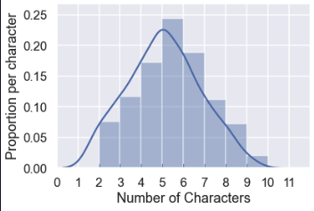
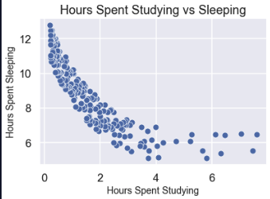

# What is EDA?

Learn about EDA and some of the techniques involved.
> **Exploration is curiosity put into action.**  
> – Don Walsh, American Oceanographer

Exploratory Data Analysis (EDA for short) is all about getting curious about your data – finding out what is there, what patterns you can find, and what relationships exist. EDA is the important first step towards analysis and model building. When done well, it can help you formulate further questions and areas for investigation, and it almost always helps uncover aspects of your data that you wouldn’t have seen otherwise.

## Goals of EDA

Depending on what you want to do with your data, EDA can take many different forms; however, the main goals of EDA are generally:

- Uncover the data structure and determine how it is coded
- Inspect and “get to know” the data by summarizing and visualizing it
- Detect outliers, missing data, and other anomalies and decide how/whether to address these issues
- Find new avenues for analysis and further research
- Prepare for model building or analysis, including the following:
  - Check assumptions
  - Select features
  - Choose an appropriate method

## EDA Techniques

Just as the goals of EDA may vary, so do the techniques used to accomplish those goals. That said, the EDA process generally involves strategies that fall into the following three categories:

- Data inspection
- Numerical summarization
- Data visualization

### Data Inspection

Data inspection is an important first step of any analysis. This can help illuminate potential issues or avenues for further investigation.

For example, we might use the pandas `.head()` method to print out the first five rows of a dataset:

```python
print(data.head())
| Student Name | Favorite Class | Age | Hours of Sleep | Hours Spent Studying |
|--------------|----------------|-----|----------------|----------------------|
| John         | Math           | 9   | 9              | 1                    |
| Sophie       | Statistics     | 17  | 7.5            | 4                    |
| Alex         | English        | 12  | 8              | 3                    |
| Liam         | Statistics     | 18  | nan            | 4.5                  |
| Colin        | Math           | 18  | 6.5            | 6.5                  |
```
Based on this output, we notice that hours of sleep is a quantitative variable. In order to summarize it, we’ll need to make sure it is stored as an int or float.

We also notice that there is at least one instance of missing data, which appears to be stored as nan. As a next step, we could investigate further to determine how much missing data there is and what we want to do about it.


### Numerical Summarization

Once we’ve inspected our data and done some initial cleaning steps, numerical summaries are a great way to condense the information we have into a more reasonable amount of space. For numerical data, this allows us to get a sense of scale, spread, and central tendency. For categorical data, this gives us information about the number of categories and frequencies of each.

In pandas, we can get a quick collection of numerical summaries using the 
```python
data.describe(include = 'all')
|                | Student Name | Favorite Class | Age   | Hours of Sleep | Hours Spent Studying |
|----------------|--------------|----------------|-------|----------------|----------------------|
| count          | 250          | 250            | 250   | 250            | 250                  |
| unique         | 177          | 15             | NaN   | NaN            | NaN                  |
| top            | Kevin        | Math           | NaN   | NaN            | NaN                  |
| freq           | 12           | 23             | NaN   | NaN            | NaN                  |
| mean           | NaN          | NaN            | 13.75 | 7.89           | 4.34                 |
| std            | NaN          | NaN            | 1.68  | 0.3            | 0.6                  |
| min            | NaN          | NaN            | 8     | 4.5            | 0.5                  |
| 25%            | NaN          | NaN            | 10.3  | 5.6            | 1.47                 |
| 50%            | NaN          | NaN            | 13.5  | 7.6            | 4.32                 |
| 75%            | NaN          | NaN            | 17    | 9.7            | 6.5                  |
| max            | NaN          | NaN            | 23    | 11             | 10.5                 |
```
Based on this table, we can see that there are 177 unique student names in our table, with Kevin being the most common. The average student age is 13.75 years with students as young as 8 years and as old as 23 years.

### Data Visualization
While numerical summaries are useful for condensing information, visual summaries can provide even more context and detail in a small amount of space.

There are many different types of visualizations that we might want to create as part of EDA. For example, histograms allow us to inspect the distribution of a quantitative feature, providing information about central tendency, spread, and shape (e.g., skew or multimodality). The histogram below shows the distribution of the number of characters in each student’s name. We see that the average name is about 5-6 characters long and up to 10 characters long.



Other kinds of visualizations are useful for investigating relationships between multiple features. For example, the scatterplot below shows the relationship between hours spent studying and hours spent sleeping.



### EDA as a Cyclical Process
Though EDA is commonly performed at the start of a project — before any analysis or model building — you may find yourself revisiting EDA again and again. It is quite common for more questions and problems to emerge during an analysis (or even EDA itself!). EDA is also a great tool for tuning a predictive model to improve its accuracy. It is therefore useful to think of EDA as a cycle rather than a linear process in a data science workflow.

### Conclusion
EDA is a crucial step before diving into any data project because it informs data cleaning, can illuminate new research questions, is helpful in choosing appropriate analysis and modeling techniques, and can be useful during model tuning.